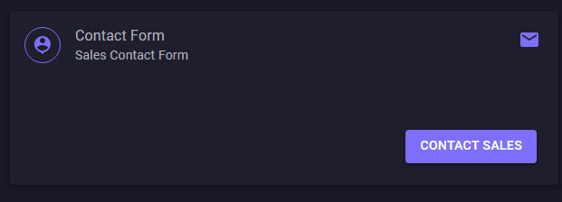
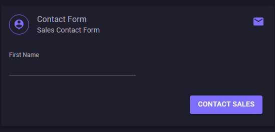

# GenericForms.MudComponents

Generic Forms in Blazor using MudBlazor, which supports Blazor Server App and WASM. This library which is used to generate Dyamic Forms from a JSON file. This library covers the below items

- Creating dynamic form components using MudBlazor.
- Handling various input types dynamically.
- Validating and submitting forms.
- Using helper methods to manage event handlers and file uploads.

## Demo:

[Click me to see the demo](https://sr-ganesh-ram.github.io/dynamic-mudform/)


## Json Editor and Viewer tool

* To install the package run the following command:

**`NuGet\Install-Package Blazor.UI.FormGenerator -Version 0.0.1.4`**
or search **Blazor.UI.FormGenerator** in Nuget gallery.

This will install `Blazor.UI.FormGenerator` in your project. You also need to add in **_Imports.razor**:
```html
@using Blazor.UI.FormGenerator
```


### How to build a Form Editor using Generic Form:

Now lets construct .JSON file called, `contact-forms.json`


The Json blueprint to construct a card. 

```json
[
  {
    "Card": "Contact-Form",
    "Elevation": 4,
    "Spacing": 2,
    "Outlined": false,
    "Class": "ma-4",
    "GridPosition": {
      "xs": 12,
      "sm": 12,
      "md": 12,
      "lg": 12
    },
    "Header": {
      "Enable": true,
      "Divider": false,
      "Avatar": {
        "Enable": true,
        "Color": "Primary",
        "Icon": "Material.Filled.PersonPin",
        "Variant": "Outlined"
      },
      "Content": {
        "Enable": true,
        "Title": "Contact Form",
        "SubTitle": "Sales Contact Form"
      },
      "CardAction": {
        "Enable": true,
        "Color": "Primary",
        "Icon": "Material.Filled.Email"
      }
    },
    "Footer": {
      "Enable": true,
      "CustomClass": "d-flex justify-end flex-grow-1 gap-2",
      "EnableCancel": false,
      "CancelText": "Cancel",
      "CancelColor": "Secondary",
      "CancelVariant": "Text",
      "EnableSubmit": true,
      "SubmitText": "Contact Sales",
      "SubmitColor": "Primary",
      "SubmitVariant": "Filled"
    },
    "Fields": []
  }
]
```
Notice that that `Field:[]` is empty meaning no files were added in the card. Now to do that, a simple json structure added below

``` json
{
    "FieldName": "FirstName",
    "Label": "First Name",
    "InputType": "Text",
    "IsReadOnly": false,
    "IsRequired": true,
    "DefaultValue": "",
    "Variant": "Text",
    "GridPosition": {
        "xs": 12,
        "sm": 6,
        "md": 6,
        "lg": 6
    }
}

```

Now if you see in the "contact card", a text box appears and it is ready to take inputs.



### Now lets see how the DynamicForm called, in parent page.

```html
@if (_formContactFormBuilders is not null)
{
    <DynamicMudForm @ref="_dynamicMudFrom" FormBuilders="_formContactFormBuilders"/>
    <MudPaper Class="ma-4 pa-4" Elevation="4">
        <MudTextField Label="JSON Control data" ReadOnly="true"
                      Variant="Variant.Filled" Lines="80"
                      @bind-Value="@jsonText"  />
    </MudPaper>
    
}
```

Now, lets see code behind used

```C#
public partial class ContactForm
{
    private DynamicMudForm _dynamicMudFrom;

    #region Initialization
    protected override async Task OnInitializedAsync()
    {
        await LoadContactForm();
    }

    #endregion

    #region Contact Details 
    FormBuilder[] _formContactFormBuilders;
    private string jsonText = string.Empty;

    private string cardTitle = "Contact-Form";
    private async Task LoadContactForm()
    {
        #region All Controls
        _formContactFormBuilders = await Http.GetFromJsonAsync<FormBuilder[]>($"json-form/{cardTitle}.json?v={DateTime.Now.Ticks}");
        jsonText = await Http.GetStringAsync($"json-form/{cardTitle}.json?v={DateTime.Now.Ticks}");

        if (_formContactFormBuilders is not null)
        {
            DynamicMudForm.AttachCard_EventAction(_formContactFormBuilders, cardTitle, CardActionClick);
            DynamicMudForm.AttachSubmitButton_EventAction(_formContactFormBuilders, cardTitle, SubmitButton_Click);
        }

        #endregion
    }

    #endregion

    #region Event Mapper
    public async Task CardActionClick()
    {
        Logger.LogInformation("Triggered the Card Action Clicked.");
    }

    public async Task SubmitButton_Click(EventArgs args)
    {
        Console.WriteLine("Submit Button Click");
        _dynamicMudFrom.GetMudFrom().Validate();
        if (_dynamicMudFrom.GetMudFrom().IsValid)
        {
            Logger.LogInformation(_dynamicMudFrom.GetFormData());
            //Console.WriteLine(_dynamicMudFrom.GetFormData());
        }
    }
    #endregion
}
```

## Next steps

- Add Chip
- Add Multi Select Chip
- Add Dynamic Views


## If you like it please support:

[Buy me a coffee](https://buymeacoffee.com/sr.ganeshram)
</br>


Thanks & Happy Coding.


